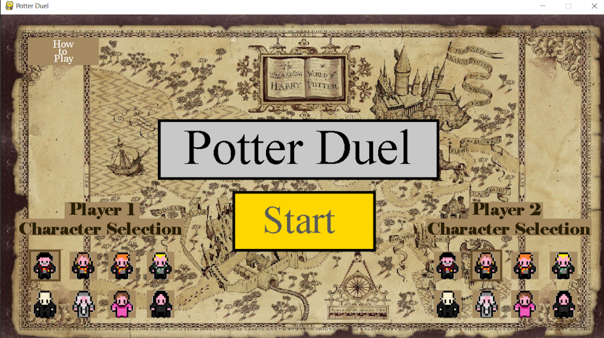
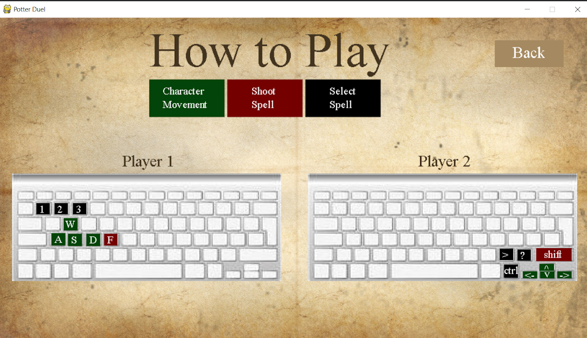
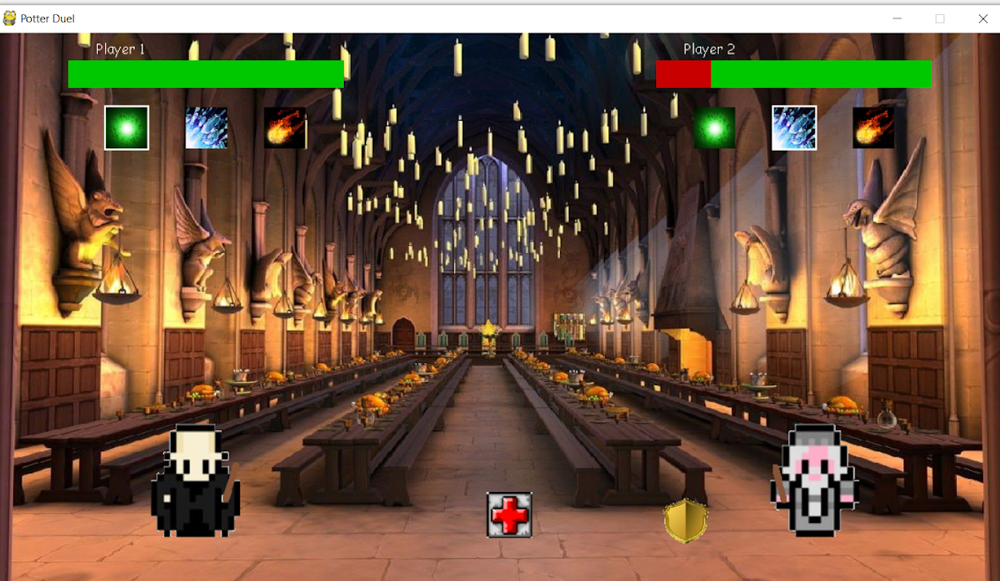

### Potter-Duel
Simple fighting game with a wizard theme. Created in python using PyGame. 

To run, download all files. Then, using a command prompt, navigate to the file with Game.py installed. Note: if PyGame is not intsalled, type "pip install pygame". Once you ensure that pygame is installed, type "python Game.py" and then the game will start.

Features:
- 1v1 Fighting game with wands
- w-a-s-d for moving player 1
- arrow keys for moving player 2
- 'f' to fire a spell for player 1
- right shift to fire a spell for player 2
- 3 spells (see 'how to play' screenshot for keys to select different spells):
  - damage spell (deals 10 damage to opponent)
  - ice spell (freezes opponent for 1.5 seconds)
  - fire spell (does damage over 5 seconds)
- health packs:
  - spawn randomly, max 1 on field at a time
  - heals 15 hp to player that walks over it
- shields:
  - spawn randomly, max 1 on field at a time
  - makes player invincible for 4 seconds

Screenshots: 

Note: I do not own any of the graphics or sound effects. I only own the code.
